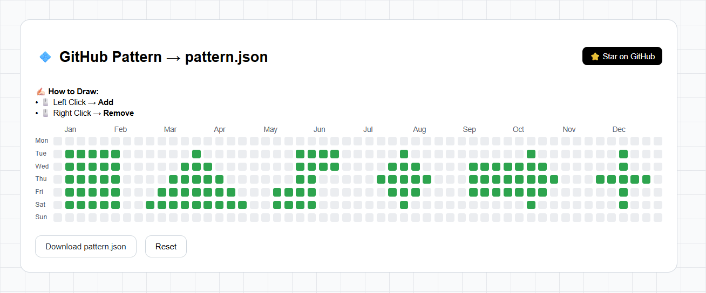

# 🎨 GitHub Pattern Generator

<div align="center">

### Draw Your GitHub Contribution Story — One Commit at a Time

Design custom GitHub contribution graph artwork visually and export it as JSON for automated commit generation.



</div>

---

## ✨ Overview

GitHub Pattern Generator is a browser-based visual editor that allows developers to create custom artwork using GitHub's contribution graph layout.

Instead of viewing contribution graphs solely as activity trackers, this project turns them into a creative canvas where you can design text, logos, symbols, pixel art, and personalized patterns.

Everything runs entirely in the browser using HTML, CSS, and JavaScript with no installation or dependencies required.

---

## 🚀 Features

### 🎨 Visual Contribution Editor

* Interactive GitHub-style contribution grid
* Real-time click and drag drawing
* Pixel-perfect pattern creation
* Instant visual feedback

### 🖱️ Easy Drawing Controls

* Left Click + Drag → Paint cells
* Right Click + Drag → Erase cells
* Fast and responsive interaction

### 📦 JSON Export

* Export designs as `pattern.json`
* Reuse and edit saved patterns
* Share designs with others

### 🤖 Automation Ready

* Compatible with GitHub contribution automation workflows
* Works with commit generation scripts
* Easy integration into existing tools

### ⚡ Lightweight

* Built with Vanilla JavaScript
* No frameworks
* No build process
* Runs directly from `index.html`

---

## 📖 How It Works

### 1. Open the Application

Launch `index.html` in any modern web browser.

### 2. Create Your Design

Draw directly on the contribution grid using your mouse.

Ideas include:

* Initials
* Logos
* Pixel Art
* Custom Signatures
* Geometric Patterns

### 3. Export Pattern

Click the export button to download your design as `pattern.json`.

### 4. Generate Contributions

Use the exported JSON with your preferred GitHub contribution automation script to recreate the design on your profile over time.

---

## 🛠️ Tech Stack

| Technology | Purpose                       |
| ---------- | ----------------------------- |
| HTML5      | Structure                     |
| CSS3       | Styling & Layout              |
| JavaScript | Drawing Logic & Export System |

---

## 📂 Project Structure

```bash
github-pattern-generator/
│
├── index.html
├── style.css
├── script.js
├── logo.jpg
├── README.md
│
└── assets/
    └── PatternDemo.png
```

---

## 💡 Use Cases

### Personal Branding

Create unique contribution graph artwork that reflects your identity as a developer.

### Automation Testing

Test commit scheduling, contribution generation, and graph rendering workflows.

### Educational Learning

Explore browser events, grid systems, JSON serialization, file generation, and interactive UI development.

---

## 🗺️ Roadmap

* [ ] Multiple contribution intensity levels
* [ ] Pattern templates
* [ ] Undo / Redo support
* [ ] Local storage auto-save
* [ ] Mobile touch support
* [ ] GitHub contribution preview mode
* [ ] Import existing patterns

---

## 🤝 Contributing

Contributions are welcome.

```bash
# Fork the repository

# Create a feature branch
git checkout -b feature/my-improvement

# Commit your changes
git commit -m "Add awesome feature"

# Push to GitHub
git push origin feature/my-improvement

# Open a Pull Request
```

---

## 💭 Inspiration

GitHub contribution graphs are usually used to visualize activity.

This project explores a different idea: treating the contribution grid as a digital canvas where developers can create meaningful artwork and personal branding directly on their GitHub profiles.

The original concept and feature architecture were brainstormed with ChatGPT, while the design, implementation, development, and customization were created by Susant Luitel.

---

## 📜 License

Distributed under the MIT License.

Feel free to use, modify, and distribute this project.

---

## 👨‍💻 Author

**Susant Luitel**

Open Source Developer from Nepal

Building tools, experiments, and developer-focused projects.

### 🌐 Connect With Me

<p align="center">

<a href="https://github.com/susantedit">
  
</a>

<a href="https://linkedin.com/in/kantaraj-luitel">
  
</a>

<a href="https://www.youtube.com/@developersusant">
  
</a>

<a href="https://instagram.com/susantgamerz">
  
</a>

<a href="https://x.com/Susantedit">
  
</a>

<a href="https://facebook.com/Kantaraj.Luitel">
  
</a>

<a href="https://codepen.io/susant-gamerz">
  
</a>

</p>


## ⭐ Support

If you found this project useful, consider starring the repository and sharing your GitHub contribution artwork.

Built and maintained by Susant Luitel.

**CODE • BUILD • SOLVE • REPEAT**
